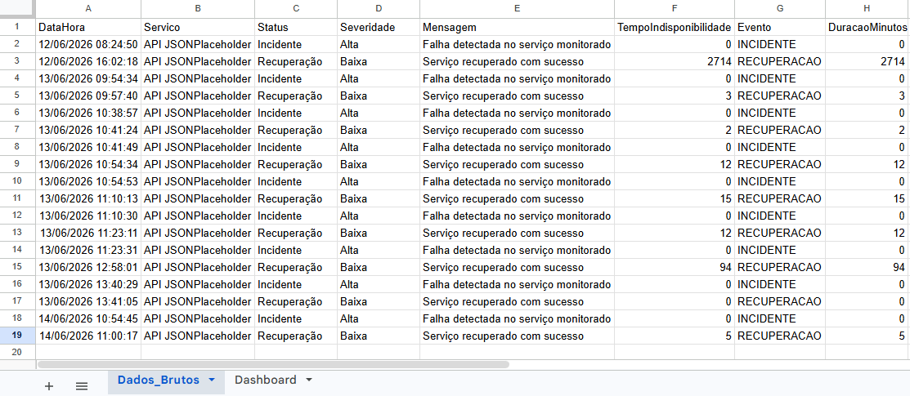
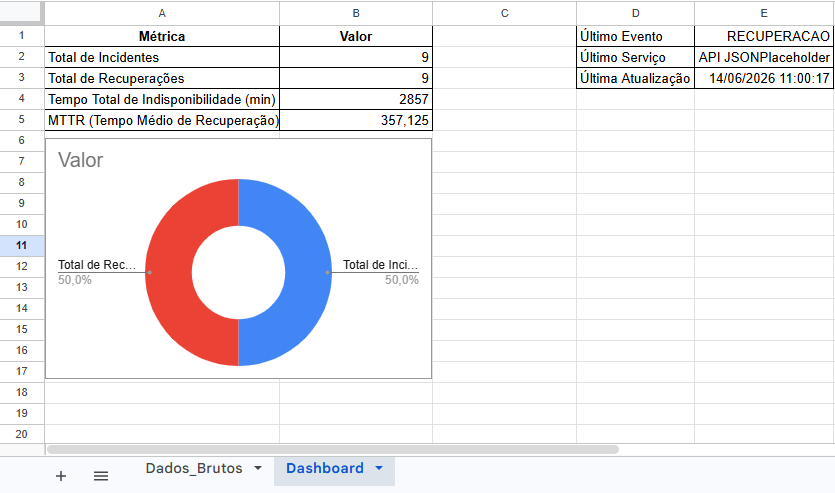
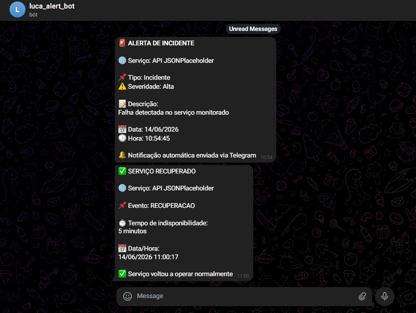

# Monitoramento de Incidentes com n8n

## Sobre o Projeto

Projeto desenvolvido para monitoramento automatizado de serviços HTTP utilizando n8n.

O fluxo realiza verificações periódicas de disponibilidade, registra incidentes e recuperações em uma planilha Google Sheets e envia notificações automáticas para um canal do Telegram.

## Tecnologias Utilizadas

* n8n
* Google Sheets
* Telegram Bot API
* HTTP Request
* JavaScript
* GitHub

## Funcionalidades

* Monitoramento automático de serviços HTTP
* Detecção de indisponibilidade
* Registro de incidentes
* Registro de recuperação
* Evita alertas duplicados
* Dashboard simples em Google Sheets
* Notificações automáticas via Telegram

## Fluxo da Automação

1. Verifica o status do serviço monitorado
2. Identifica indisponibilidades
3. Registra incidentes no Google Sheets
4. Envia alerta para o Telegram
5. Monitora o retorno do serviço
6. Registra a recuperação
7. Atualiza métricas e dashboard

## Dashboard

O dashboard apresenta:

* Total de incidentes
* Total de recuperações
* Tempo total de indisponibilidade
* MTTR (Tempo Médio de Recuperação)

## Capturas de Tela

### Fluxo n8n

### Dados Brutos

### Dashboard

### Alertas Telegram

## Como Utilizar

1. Importe o arquivo JSON do workflow no n8n.
2. Configure as credenciais do Google Sheets.
3. Configure as credenciais do Telegram.
4. Ajuste a URL do serviço monitorado.
5. Ative o workflow.

## Objetivo

Este projeto foi desenvolvido para estudo de automação, monitoramento de serviços e boas práticas de observabilidade utilizando n8n.
